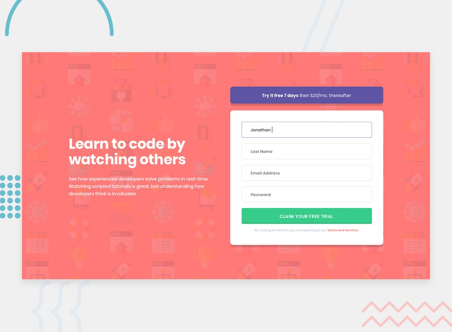

# Intro Component with Sign-up Form - Frontend Mentor Solution

This is a solution to the [Intro component with sign-up form challenge on Frontend Mentor](https://www.frontendmentor.io/challenges/intro-component-with-signup-form-5cf91bd49edda32581d28fd1).

## Table of contents

- [Overview](#overview)
  - [The challenge](#the-challenge)
  - [Screenshot](#screenshot)
  - [Links](#links)
- [My process](#my-process)
  - [Built with](#built-with)
  - [What I learned](#what-i-learned)
- [Author](#author)

## Overview

### The challenge

Users should be able to:

- View the optimal layout for the site depending on their device's screen size
- See hover states for all interactive elements on the page

### Screenshot



### Links

- Solution URL: [Add your repository URL here]
- Live Site URL: [Add your GitHub Pages URL here]

## My process

### Built with

- Semantic HTML5 markup
- CSS Custom Properties (Variables)
- Flexbox
- Mobile-first workflow
- Responsive Design (Media Queries)

### What I learned

This project was a great practice for responsive layouts. I learned how to shift from a single-column layout on mobile to a two-column split layout on desktop using Media Queries.

I also improved my attention to detail with CSS syntax and unit values, realizing how small typos in `max-width` or color definitions can drastically affect the final layout.

Key code snippet for the layout shift:

```css
/* Mobile First approach */
.container {
    flex-direction: column;
}

/* Desktop layout */
@media (min-width: 900px) {
    .container {
        flex-direction: row;
        align-items: center;
        max-width: 1110px;
    }
}

```

I also practiced styling form inputs to match a specific design system, removing default browser styles and applying custom borders and shadows.

Author

    Frontend Mentor - @rossydDev

    GitHub - rossydDev